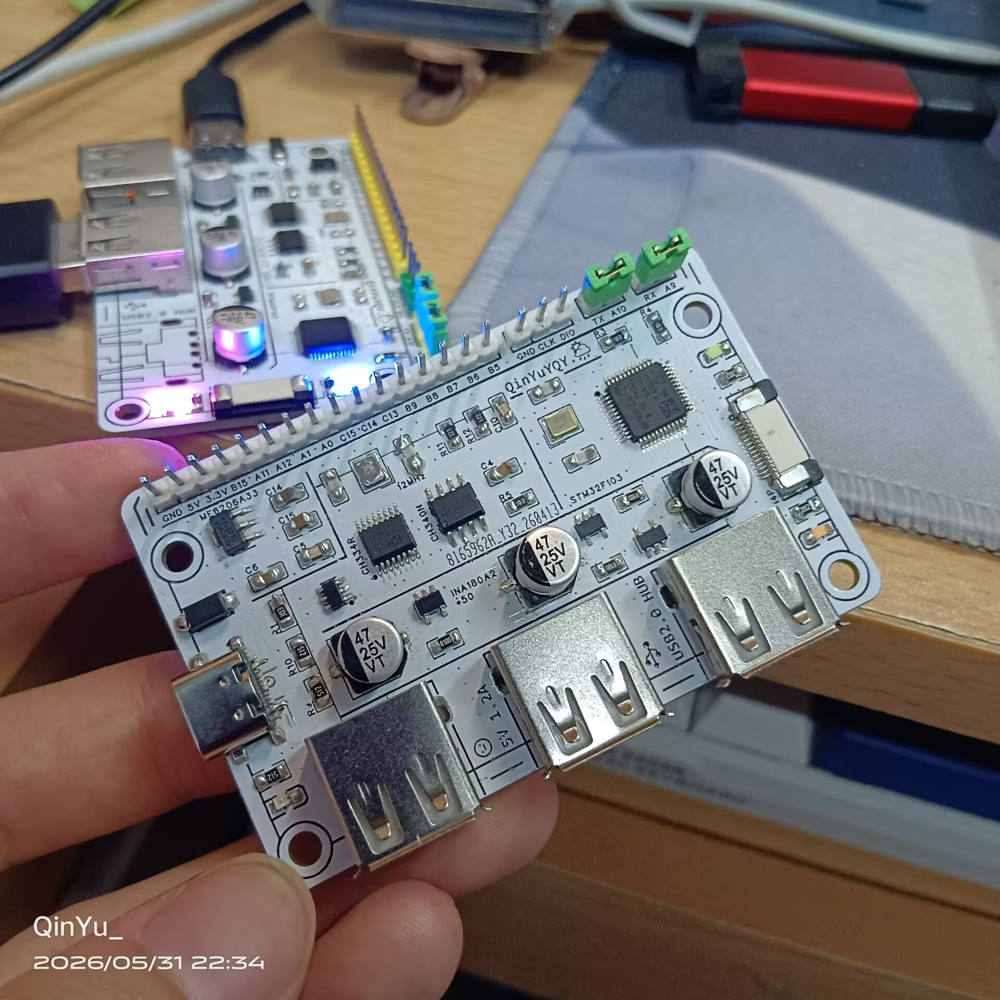
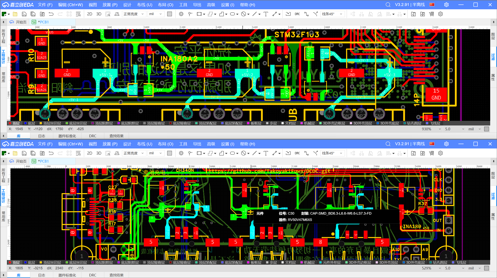
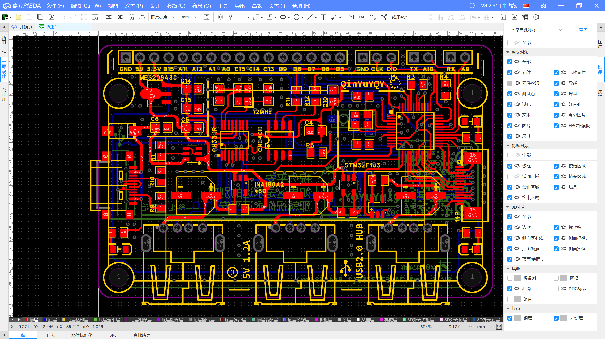
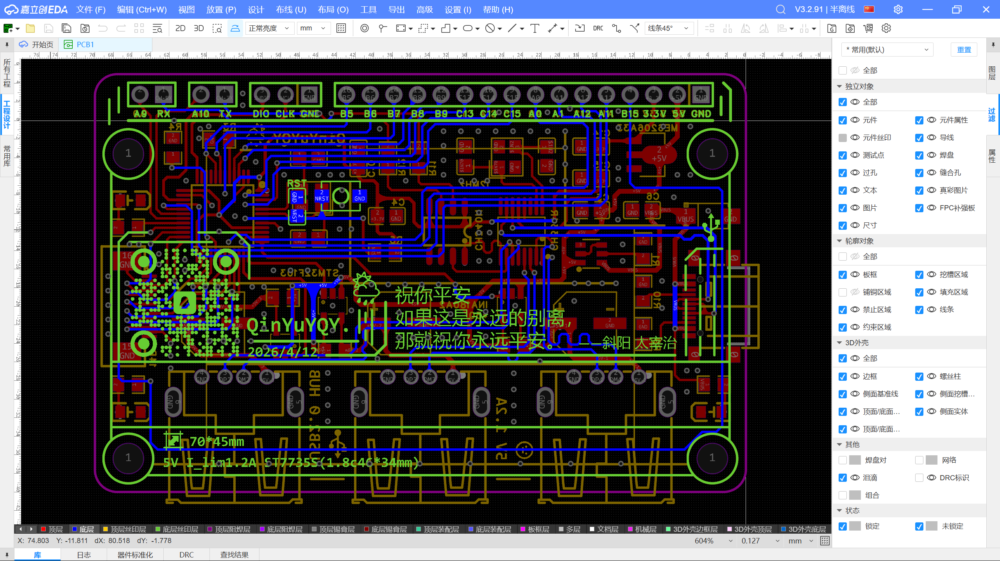
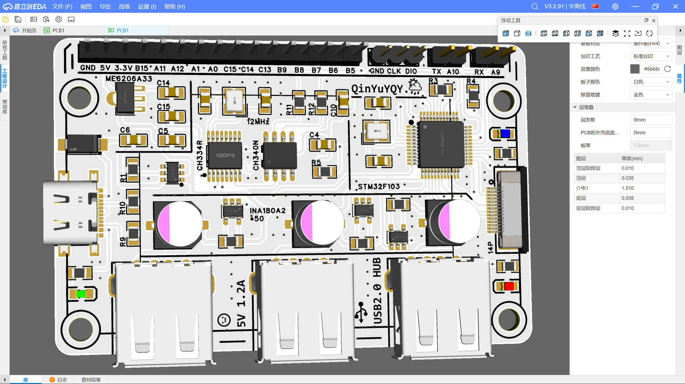

## 带有电流表的扩展坞            
*2026/5/31*                         
尺寸依然是7cm*5cm，              
每个下游端口都配备了一个INA180来放大采样电阻电压测电流          
还加了一个1.8寸的屏幕的软排线座 用来放屏幕                     
自带USB转串口芯片，还有排针引出              
总之w 还挺满意的....                

          
       
## 实拍图片
                   
                
                      

               
        
### **问题是：**             
在远离输入端口的输出端口位置接大电流(***>200mA***)负载时，              
靠近输入端的端口就算**没接负载**也会有大概10~24mA被检测，              
在飞线测试时，发现每个输出端口的供电输入单独一根线即可避免。       
虽然现象可能已经解决，
但理论分析可能需要补习关于***电源完整性(PI)***的内容。            
* ***两种布线方式：***                
（*关注电源线走线*）              
        

上图为这块电路板，                     
电源输入(绿)进入后几乎以串联的方式依次通过各个输出端口，          
推测有一定的电容影响，降低高频阻抗，               
放大了这种布线方式带来的电流问题。           

下图为最近测试画的一块电路板，类似的布局方式与电容电阻。                
但电源线(绿)从输入排针开始，分别走三条线，                  
同时电容的位置也放到了采样电阻与电源输入线之间，                         
等待板子到货后实际测试。          

(2026/5/31-23:14)

## EDA：          

2026/5/31-22:30                         
好像是4/6开始创建的文件夹....             
从制版到现在居然整整用了快两个月....            
其实好像板子用了一周就画好了，
到货了之后一直不想焊的意思....
嘛....

